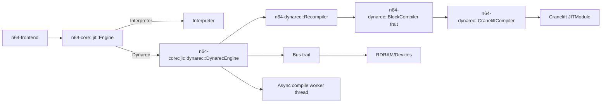
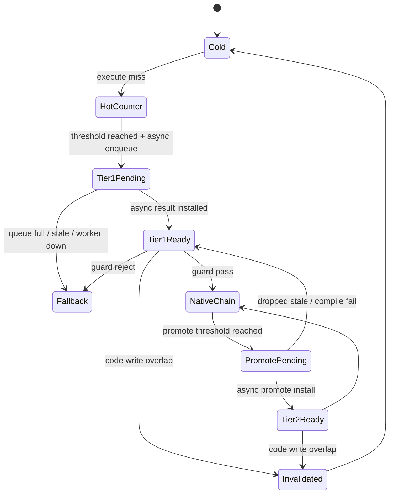
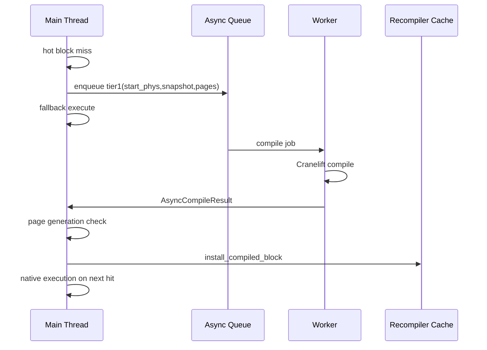
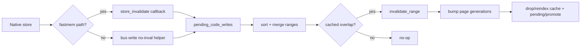

# Dynarec Architecture and Performance Audit

Last updated: 2026-02-22

This document describes the current JIT architecture across `n64-core` and `n64-dynarec`, how execution/tiering/invalidation work end-to-end, and a prioritized list of encapsulated performance wins.

## 1. Goals and Constraints

- Stable Rust only (no nightly features required).
- Dynarec must be optional at build and runtime.
- Correctness baseline is interpreter-equivalence.
- Keep unsafe surfaces narrow and explicit.
- Support tiered compilation with async background work to avoid frame stutter.

## 2. Build and Runtime Gating

Build-time:

- `crates/n64-core/Cargo.toml` feature `dynarec` gates integration with `n64-dynarec`.
- `n64-core` currently enables `dynarec` by default (`default = ["dynarec"]`).

Runtime:

- `Engine::from_env()` in `crates/n64-core/src/jit/mod.rs` chooses interpreter or dynarec.
- `N64_DYNAREC=0|off|false|no` forces interpreter.
- `N64_DYNAREC=1|on|true|yes|cranelift` forces dynarec.
- Frontend flags can override (`--jit`, `--no-jit`, `--tiering`, `--no-tiering`).

## 3. High-Level Architecture



Key boundary:

- `n64-dynarec` owns compiler/backend logic and block cache primitives.
- `n64-core` owns runtime policy: hotness, guard checks, gas/event budgeting, native chaining, async queue policy, and fallback behavior.

## 4. Block Lifecycle



## 5. Execution Pipeline (Main Thread)

Per `DynarecEngine::execute`:

1. Drain async compile results.
2. Refill compile budget (if enabled).
3. Early guard checks (`delay_slot`, non-linear PC, non-kseg address) -> interpreter fallback.
4. Cache lookup by `start_phys`.
5. If cache hit: native guard checks (interrupt/timer/shape checks).
6. If guard passes: run native chain with gas/event bounds.
7. If miss: hotness accounting and tier1 compile path.
8. Tier1 compile path prefers async enqueue; may use sync compile if enabled by state.

```mermaid
flowchart TD
    A[execute()] --> B[drain async results]
    B --> C[refill compile budget]
    C --> D{early guards pass?}
    D -- no --> I[fallback interpreter]
    D -- yes --> E{cached block?}
    E -- yes --> F{native guard pass?}
    F -- no --> I
    F -- yes --> G[run_native_chain]
    E -- no --> H{hot + queue/budget allow compile?}
    H -- no --> I
    H -- yes --> J[enqueue async tier1 or sync compile]
    J --> K{block now cached?}
    K -- yes --> G
    K -- no --> I
```

## 6. Native Chain Semantics

Native chain execution is bounded by:

- `native_gas_limit` (`N64_DYNAREC_NATIVE_GAS`).
- Optional `chain_limit` (`N64_DYNAREC_CHAIN_LIMIT`, 0 = unlimited).
- External interrupt-event horizon (`Bus::cycles_until_next_interrupt_event()`).
- Timer safety caps for backedges (`COUNT`/`COMPARE` guard logic).

The chain can jump block-to-block using a native link cache (`native_links`) when:

- Next PC is linear and kseg direct-mapped.
- Target block exists and page generations still match.
- Target block passes native guard checks.

## 7. Async Tiering Architecture

Tiering modes:

- Tier1 compile budget (`tier1_max_block_instructions`, typically small).
- Tier2 promotion (`max_block_instructions`, typically larger).

Both can be compiled off-thread via a worker fed by snapshot jobs.



Stale-result handling:

- Each async job carries page-generation snapshots.
- Install is dropped when generations no longer match.
- Invalidations also clear pending/promote tracking indexes.

## 8. Memory and Invalidation Model

Two invalidation paths coexist:

1. Global bus-side invalidation for DMA/CPU writes that can change code.
2. Native fast-store invalidation feedback from generated code.

Fast-store path:

- Generated fastmem store emits `store_invalidate` callback (`phys,len`).
- Runtime queues per-block pending ranges.
- End of block: ranges are sorted/merged.
- Runtime checks overlap and calls `invalidate_range`.
- `invalidate_range` bumps page generations and invalidates cache/pending/promote indexes.



## 9. Cranelift Lowering Strategy

Compiler entrypoint:

- `CraneliftCompiler::compile` in `crates/n64-dynarec/src/lib.rs`.
- Decodes a linear trace of `TraceStep::Op` and `TraceStep::Branch`.
- Supports many integer ops, memory ops, COP1 arithmetic/compare paths, and branch forms.
- Unsupported non-branch instructions can become `Op::Interp` (hostcall fallback inside native block).

IR shape:

- GPRs are modeled as Cranelift variables (`Variable`), loaded once at entry, spilled at exit.
- Multi-way branch lowering uses explicit basic blocks and Cranelift block parameters (SSA phi behavior).
- Branch-likely forms model delay-slot execution semantics explicitly.

Fastmem:

- For eligible direct-mapped addresses, generated code performs guarded native load/store with big-endian byte swaps.
- Otherwise it hostcalls typed bus helpers.

## 10. Runtime Callback Surface (Unsafe Boundary)

Main unsafe contracts:

- Hostcall trampoline function signatures (`RuntimeCallbacks` ABI).
- `BlockEntry` function pointer cast to generated signature.
- Callback context raw pointers in `n64-core` (`CallbackContext`).

Minimization strategy used:

- Unsafe code is centralized around callback entry/exit and JIT entry call.
- Most policy/state management remains safe Rust.

## 11. Configuration Knobs

Primary knobs (from `DynarecEngine::new_cranelift` and Cranelift setup):

- `N64_DYNAREC_HOT_THRESHOLD` (default 24)
- `N64_DYNAREC_MAX_BLOCK_INSNS` (default 512)
- `N64_DYNAREC_TIER1_MAX_BLOCK_INSNS` (default min(max,32))
- `N64_DYNAREC_PROMOTE_THRESHOLD` (default 16; 0 disables promotion)
- `N64_DYNAREC_ASYNC_PROMOTE` (default on)
- `N64_DYNAREC_ASYNC_SNAPSHOT_INSNS` (default 256)
- `N64_DYNAREC_ASYNC_QUEUE_LIMIT` (default 256)
- `N64_DYNAREC_ASYNC_QUEUE_BACKOFF_MS` (default 1)
- `N64_DYNAREC_MIN_BLOCK_INSNS` (default 2)
- `N64_DYNAREC_NATIVE_GAS` (default 8192)
- `N64_DYNAREC_CHAIN_LIMIT` (default 0/unlimited)
- `N64_DYNAREC_LINK_FANOUT` (default 8)
- `N64_DYNAREC_COMPILE_BUDGET_US_PER_MS` (default 0/disabled)
- `N64_DYNAREC_COMPILE_BUDGET_BURST_MS` (default 30)
- `N64_CRANELIFT_OPT_LEVEL` (global default for tier opts)
- `N64_DYNAREC_TIER1_OPT_LEVEL`, `N64_DYNAREC_TIER2_OPT_LEVEL`
- `N64_CRANELIFT_VERIFY` (IR verifier toggle)

## 12. Correctness and Test Coverage

Current coverage includes:

- `n64-core` differential tests comparing dynarec vs interpreter for arithmetic, memory, delay-slot semantics, and backward branches.
- `n64-core` dynarec runtime tests for async enqueue behavior and external event retire caps.
- `n64-dynarec` unit tests for compile/decode behavior, invalidation/cache behavior, branch handling, memory ops, and COP1 fastmem paths.

## 13. Current Work Tracking

Performance snapshots, prioritized optimization tasks, and implementation-order guidance are tracked separately in:

- `doc/dynarec_perf_backlog.md`
